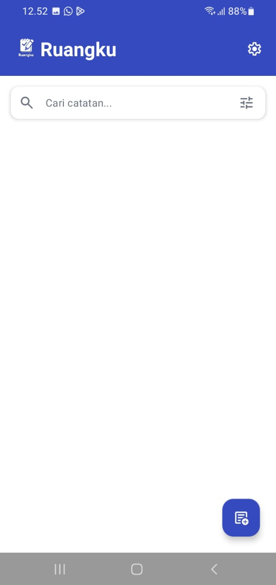
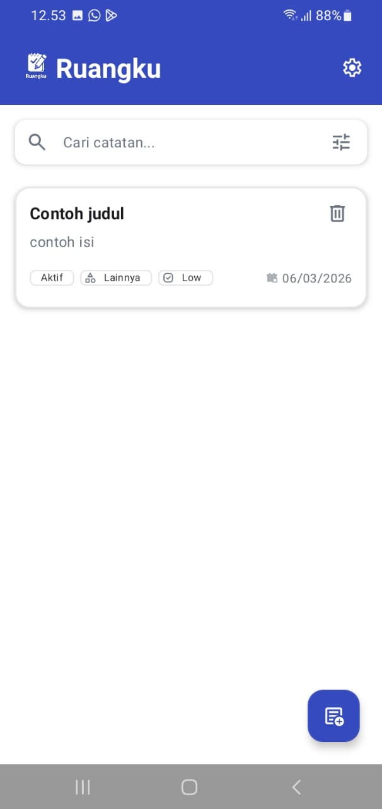
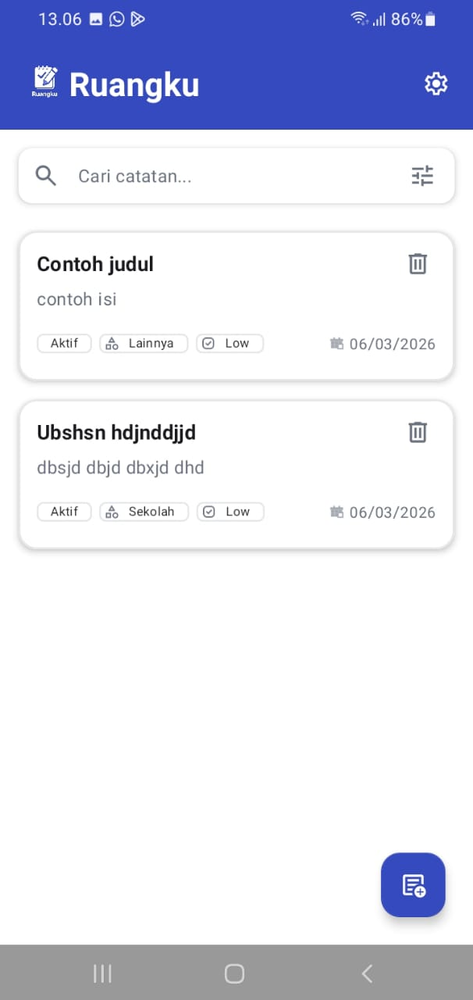
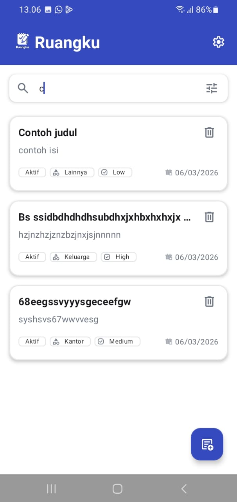
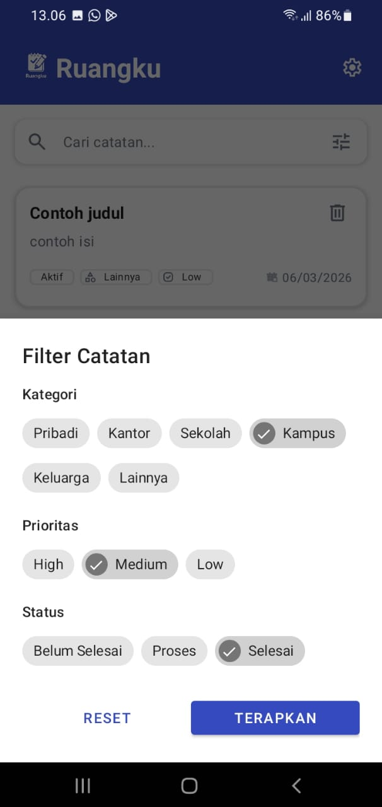
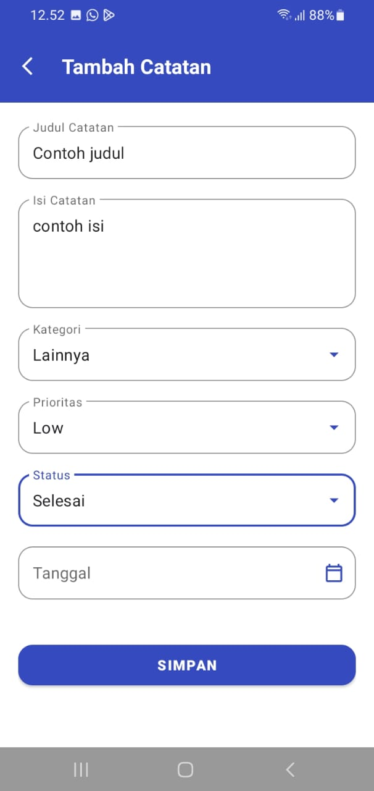
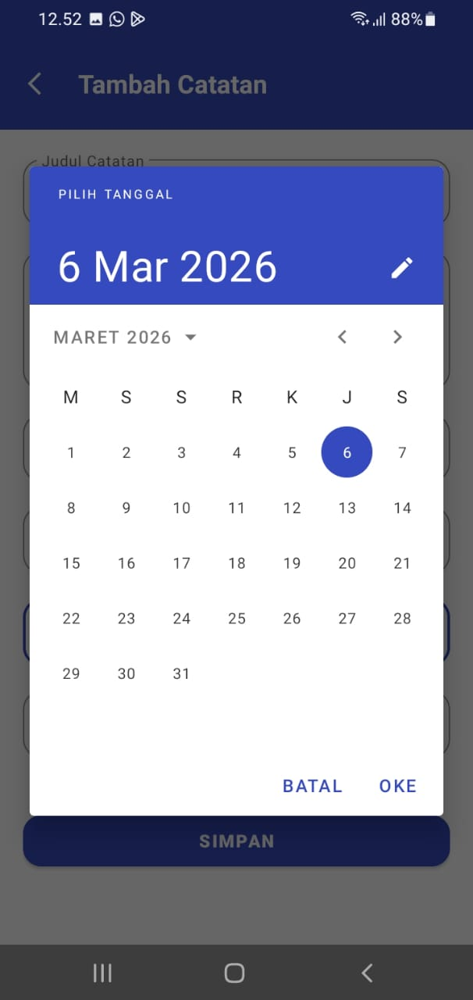
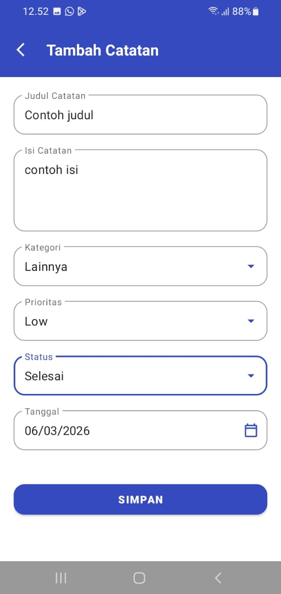
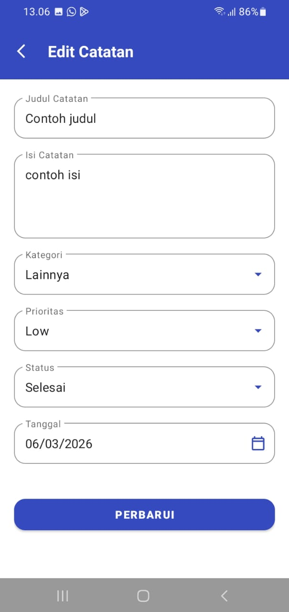
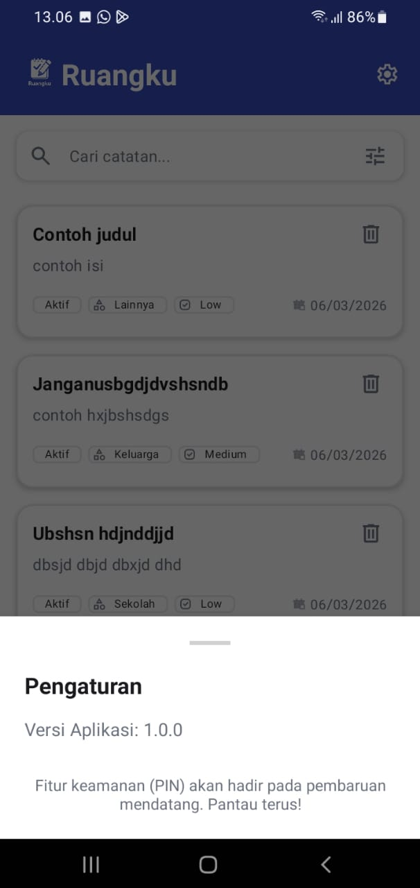

# 📝 Android Ruangku - Note App

Aplikasi Android sederhana untuk mencatat ide, tugas, dan informasi penting dengan mudah.

---

## 📱 Splash Screen

  

---

## 🏠 Daftar Catatan (Main)

   
   
   
   
  

---

## ➕ Tambah & Edit Catatan

   
   
  
  

---

## ⚙️ Pengaturan & Lainnya

  

---

## ✨ Fitur Utama
* **Manajemen Catatan:** Tambah, edit, dan hapus catatan dengan cepat.
* **Antarmuka Bersih:** Desain simpel yang fokus pada kemudahan menulis.
